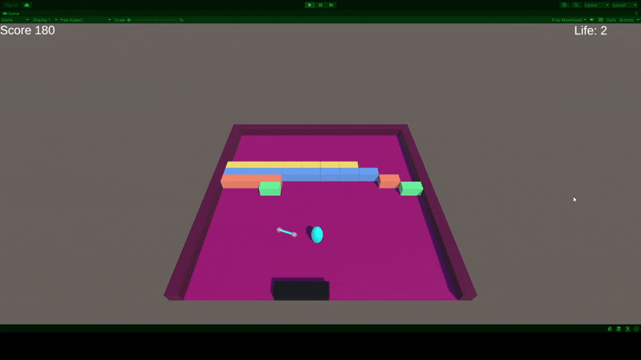

# Unity Arkanoid game

Short demo of a simple Arkanoid game made in Unity.

## Features

### Block Lives/Score:
- Green = 1 = 10 points
- Red = 2 = 20 points
- Blue = 3 = 30 points
- Yellow = 4 = 40 points
- Total = 34 blocks = 800 points

### Power-Ups:
-Collide generally only with the paddle

### Multiball:
- Creates 4 balls in front of the paddle
- Multiballs do not count as a loss, only the main ball
- Balls bounce off each other

### Laser: 
- Produces ~9 shots until time runs out
- Collides with the blocks & the back wall

### Player:
- Has 3 lives
- On loss, the ball & paddle are reset to the center
- The game waits for the player's first move
- When lives are 0, a Game Over message is displayed & player rendered incapacitated

## Demo

## Gameplay Demo

## Tech

- Unity
- C#
